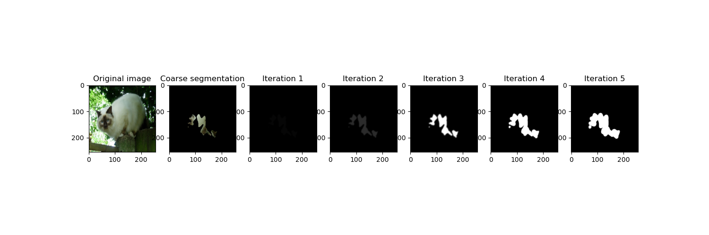
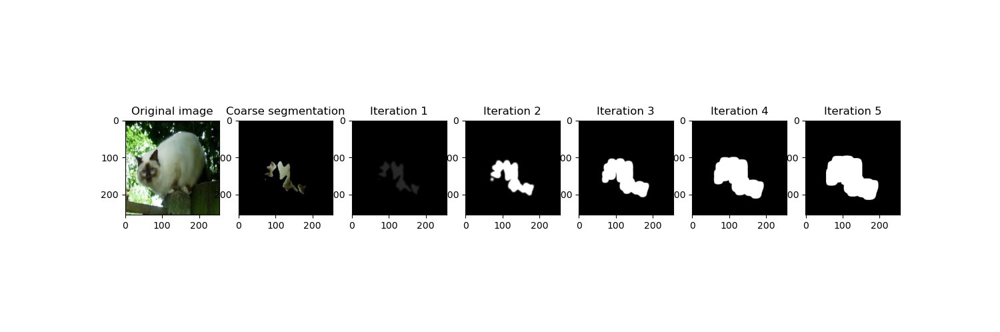

# CV2023 - PA3

### Sanha Hwang (20231126)




(up)-CSPN , (down) - DYSPN

- 본 폴더의 구성은 다음과 같습니다.

```
  PA3
  ├── affinity
  │ ├── train, vaild : train 과 valid에 대해 CSPN에 대한 결과물(segmentation)
  │ └── train_dyspn, vaild_dyspn : train 과 valid에 대해 DYSPN에 대한 결과물(segmentation)
  │
  │── coarse_seg
  │ ├── train, valid : 직접 짠 Unet으로 얻은 coarse segmentation
  │ └── train2, valid2 : smp.Unet()으로 얻은 coarse segmentation
  │ 
  ├── README.md
  │ 
  ├── result : selected result
  │  
  ├── intermidiate_result : result of CSPN & DYSPN for each iteration (.npy) # 5,1,1,256,256
  ├── 20231126_sanhaHwang_PA3 : report
  │ 
  ├── coarse.py : corase segmentation을 구하는 코드
  ├── model.py : Unet, CSPN, DYSPN 구현
  ├── main.py : main script for PA3
  ├── matric.py : Measure MIOU of masks
  └── visualize.py : To visualize result
```

- 따라서 본 폴더로 디렉토리를 변경한 후 (./PA3/) 아래의 코드를 스크립트에서 실행하면 됩니다.
- 만약 디렉토리가 없을 경우 생성하고 실행하면 됩니다.
- selected 이미지를 제외하고 나머지 coarse_seg 와 intermidiate_result, affinity는 용량관계 상 구글 드라이브에 첨부했다. [Link](https://drive.google.com/drive/folders/1kV9-TQHdiwQ7pMRG9gwUU6LokgPhFFcb?usp=sharing)
- 해당 디렉토리(./PA3/)에 coarse_seg를 압축 풀면 아래의 main.py 스크립트를 동작할 수 있다.
- cspn과 dyspn은 main.py 스크립트의 274번 라인의 c라는 hyper parameter를 True로하면 CSPN, False로 하면 DYSPN을 동작할 수 있다.

```
python coarse.py
python main.py
```

- visualize를 하고 싶으면 visualize.py를 실행시키면되는데, 스크립트 안에서 train, valid를 선택할 수 있고 intermidiate_vis함수가 attention 결과를 보여주는 함수이기 때문에 사진 번호, intermidiate_vis함수가(iteration 숫자, train/valid)로 선택해서 볼 수 있다.

```
# 스크립트 안에서 수정
intermidiate_vis(101, 5, "train") # train set의 101번 이미지 5 iteration 결과까지 표시
```

```
python visualize.py
```
